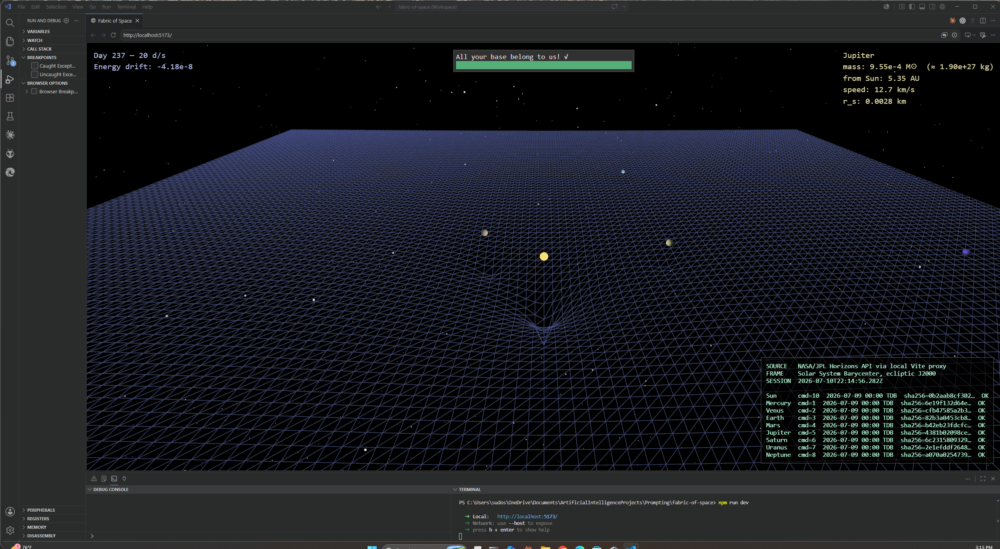
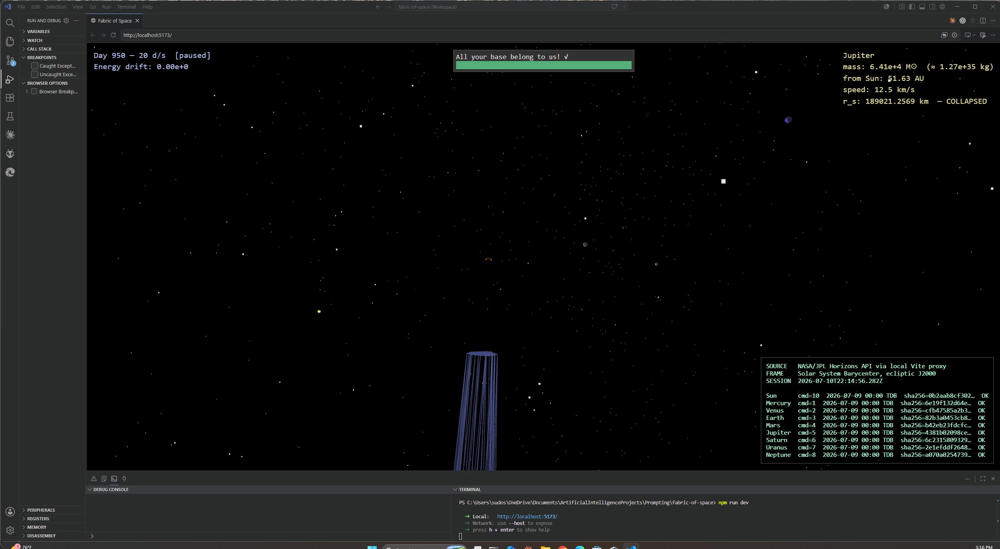
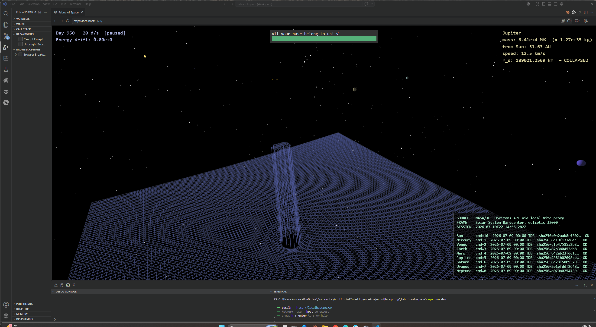
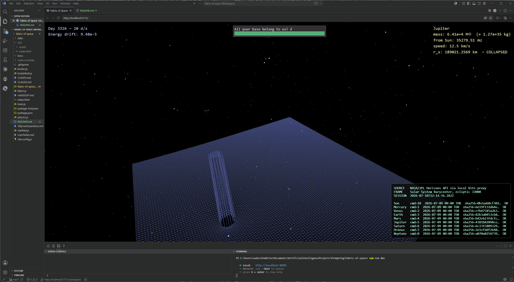

# Fabric of Space

**[Open it in your browser →](https://shahamby.github.io/fabric-of-space/)**
*(no install; the hosted build carries its own data snapshots)*

An interactive 3D solar system where gravity is something you can *see*.









The gravitational potential of every body is rendered as a displaced wireframe
mesh — the classic "trampoline" picture of spacetime, except the math is real.
Every vertex of the sheet asks the same question: *how deep is the gravity
well here?* The planets answer by moving on it, integrated with an
energy-honest N-body simulation running on real NASA data that the app
fetches for itself.

Push a planet's mass far enough and you'll find out what happens when the
trampoline can no longer stretch: it tears. The app detects when a body's
radius falls inside its own Schwarzschild radius, dresses it in black, rings
its horizon, and rips the fabric beneath it. (Fair warning from field
testing: the resulting three-body chaos once ejected a collapsed Jupiter
2.8 light-years from the Sun. The energy ledger stayed balanced the whole
way out.)

## What's real and what's display

The core rule of this project: **physics never cheats — only rendering
cheats, and every cheat is confessed.**

- The simulation runs a leapfrog (velocity Verlet) N-body integrator in
  barycentric ecliptic J2000 coordinates — units of AU, days, and solar
  masses. Energy drift is monitored live on screen and typically oscillates
  around 1e-7 with no trend.
- State vectors come from the NASA/JPL Horizons API. On demand (the `L`
  key), the app fetches fresh vectors for the Sun and all eight planets and
  re-anchors the running simulation to *yesterday at 00:00 TDB* — reality as
  of about a day ago.
- Every display shortcut (planet size exaggeration, well-depth gain,
  log compression, the black-hole tear's visibility scaling) is logged in
  [CHEATS.md](CHEATS.md) with its location, rationale, and escape hatch.
  Press `T` at any time to flatten the display back to honest scale.
- Every external dataset — shipped or live-fetched — is tracked with query
  URL, retrieval timestamp, and SHA-256 checksum. Press `P` for the in-app
  provenance panel, `D` to download the session's provenance record as JSON.

Black-hole detection uses the Schwarzschild radius, r_s ≈ 2.95 km × (mass
in solar masses) — one of the rare quantities where the naive derivation and
full general relativity agree exactly. Detection and display are honest; the
dynamics stay Newtonian (that's cheat #5 in the ledger).

## Quick start

Requires Node.js and npm.

```bash
git clone https://github.com/shahamby/fabric-of-space.git
cd fabric-of-space
npm install
npm run dev
```

Open the printed localhost URL (default port 5173). The app boots from a
shipped data snapshot, so it works offline; press `L` to go live. Live
fetches route through Vite's dev-server proxy (server-to-server, so the
browser's CORS policy never applies) — no API key needed, and nothing is
sent anywhere except your request to NASA.

## Controls

| Key | Action |
| --- | --- |
| Click | Select a body — info panel shows mass, distance, speed, and its Schwarzschild radius |
| Drag / scroll | Orbit and zoom the camera |
| `Space` | Pause / resume the integrator |
| `=` / `-` | Double / halve the selected body's mass (collapse check runs on every change) |
| `N` | Spawn a rogue body |
| `[` / `]` | Halve / double time scale (1–2048 simulated days per second) |
| `T` | Toggle true-scale display — the honest, nearly-flat universe |
| `L` | Load live epoch — re-anchor the sim to real NASA data from yesterday |
| `P` | Toggle the provenance panel |
| `D` | Download session provenance (JSON with per-body SHA-256) |

Recipe for a black hole: select Jupiter and press `=` twenty-five times.
Press 24 leaves the horizon buried ~23,000 km beneath the cloud tops;
press 25 brings it out. Press `-` to change your mind — collapse is
reversible here, if nowhere else in nature.

## Project anatomy

- `main.js` — stage, animation loop, interaction, live-data pipeline
- `physics.js` — accelerations, leapfrog integrator, total energy
- `fabric.js` — the potential-displaced sheet, including the tear
- `bodies.js` / `bodyMesh.js` — body construction, physics/render split
- `data/bodies.json` — shipped state-vector snapshot (JPL Horizons)
- `data/provenance.csv` — audit trail for every dataset
- `CHEATS.md` — the ledger of every display-vs-reality divergence
- `CLAUDE.md` / `HANDOFF.md` — living spec and session-handoff notes from
  this project's development process (see below)

## How it was built

This project is a human/AI pairing experiment: a beginner coder (with a
senior network-security background) hand-typed the majority of the code,
following exemplar patterns from Anthropic's Claude, which scaffolded the
math-heavy modules, supplied real data, and audited every milestone against
the repository as ground truth. The working agreement, milestone status,
and every physics shortcut live in `CLAUDE.md` and `CHEATS.md` — the
development process kept the same rule as the simulation: no silent
approximations.

## Roadmap

v1 (this repo) is the solar sandbox — complete through M7, the
event-horizon renderer. The backlog includes a post-Newtonian correction
term (watch Mercury's perihelion precess — the 43 arcseconds per century
that Newton couldn't explain). v2 is a galaxy tier: a Milky Way star map
with galactic gravitational potential, culminating at Sagittarius A* —
where the black hole is no longer a sandbox trick.

## Data credit

Ephemeris data: [NASA/JPL Horizons System](https://ssd.jpl.nasa.gov/horizons/),
Solar System Dynamics Group, Jet Propulsion Laboratory. A public,
unauthenticated science API of remarkable quality — be polite to it; this
app fetches sequentially, one body at a time, on demand only.
